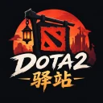

<p align="center">
	
</p>

<h1 align="center">DOTA2 驿站</h1>

<p align="center">
	<a href="https://dota2.hiwenbin.com/"><b>🌐 在线预览：dota2.hiwenbin.com</b></a>
</p>

面向中文玩家的 DOTA2 门户：OB 开播状态与网页端分屏直播、资讯（官方新闻、两个 Reddit 版块与
NGA / 虎扑社区热议）、赛事赛程与战报、版本更新日志、英雄与装备资料、BP 阵容分析，外加 Steam 登录的
个人战绩，以及一间开黑房间（房间状态放在 Cloudflare Durable Object 里，浏览器一条 WebSocket 连过去）。
用 Astro 构建：内容页全部预渲染成静态 HTML，只有登录相关的
那几条路由按请求渲染。

## 功能

- **分屏直播**（`/live`）：斗鱼用服务端解析出的直链自己播，虎牙嵌官方播放器，解析不到时退回
  「嵌整页 + 取景」兜底；格子可拖分隔条改比例、可全屏，斗鱼格子自带弹幕
- **OB 大家庭**（`/ob`）：十人名单、外号、荣誉与固定直播间，附各人名场面视频
- **资讯**（`/news`）：官网新闻、r/DotA2 热帖、r/compDota2 的赛事讨论、NGA 与虎扑，五个来源各一条
  列表，一次看一条。新闻正文与热帖主楼都抓回站内阅读；两个中文社区来源的回复数口径不同，
  所以分开列、不合并排序，原因写在页面底部的「数据口径」里
- **官方赛事**（`/tournaments`）：TI / Major / ESL 等赛事的赛程与赛果，带战队页；对阵页按小局
  列出每一局的阵容、BP 与选手数据（日历上的一条是 BO3/BO5，Valve 的每个比赛 id 只是一局）
- **阵容分析**（`/draft`）：两种录法——一手一手录 BP，或勾上「直接选阵容」跳过 BP、两边各点五个
  英雄。填了对方队名就去取他们近 30 天的真实 BP（单列一栏「对面擅长」，这些英雄也进候选范围）；
  双方阵容锁完后给出 17 行维度对比与胜率，胜率只由实测的号位偏差与对位偏差相加，结构分、时间曲线
  与**线上对位**（谁在线上打谁、和谁走一路）只做横向对比，不算进胜率。可选填自己的 DeepSeek key
  让模型解释每一手与写复盘，key 只存在浏览器本地
- **版本信息**（`/patches`）：7.08 到最新共 118 个版本的更新日志，按「英雄 → 技能 / 天赋 / 命石」分层
- **英雄与装备**（`/heroes`、`/items`）：属性、定位、出装与物品资料；每个英雄另有
  **高手攻略**（`/heroes/<id>/guides`），按五个位置列出高分与职业对局，点开是那一局的加点顺序、
  天赋选择与出装时间轴
- **个人战绩**（`/me`）：Steam OpenID 登录后看概况、比赛、英雄、队友与对手、进展、分析六个子页，
  以及每场的记分板
- **开黑房间**（`/party`）：建房、大厅、分队伍、roll 点、聊天。房间在服务端（Durable Object），
  一条 WebSocket 搞定，手机流量、公司网都不需要打洞
- **在线人数**（首页「刀塔有多热」）：当前在线、24 小时峰值与历史峰值，外加一条本站自己记录的
  趋势折线，可切 24 小时 / 7 天 / 30 天。历史峰值 Steam 没有官方口径，取 SteamCharts 的统计值
  并在页面标明来源

## 形态与技术栈

- Astro 7 + Tailwind 4，`output: static`；适配器只为那几条 `prerender = false` 的路由存在，
  Node 自托管与 Cloudflare Workers 两套产物都支持，用 `DEPLOY_TARGET` 切换
- 数据全部在构建期抓取后落进 `.cache/`，页面上的动态内容都标注抓取时间，不假装实时
- 主播头像、B站封面、更新日志图标在构建期取回本地再自己发布，避免外链换来的破图
- 没有数据库：会话是无状态签名 Cookie，开黑房间的房间状态放在 Durable Object 的 storage 里
  （空置 10 分钟即删）

## 快速开始

不想本地跑的话，线上已经挂着：<https://dota2.hiwenbin.com/>

```sh
pnpm install
pnpm dev        # http://localhost:4321
pnpm build      # 产物在 dist/client（静态）+ dist/server（SSR）
pnpm preview    # 预览构建产物（会起服务端，不是纯静态预览）
pnpm check      # 纯 node 的自检：缓存写入、弹幕编解码、队伍逻辑、Steam ID 解析…
```

第一次 `pnpm build` 会联网把所有来源抓一遍（冷启动一两分钟），结果缓存在 `.cache/`，
之后是秒级。`.cache/` 已在 `.gitignore` 里，删掉不丢东西，只是下次要重抓。

换 logo、重抓字体、改主题色见 [品牌资源与主题色板](./docs/branding.md)。

## MCP（可选）

`mcp/` 下是一个 MCP server，把站里的英雄胜率、对位和 BP 建议做成 AI 能调的工具——
在 Claude、Cursor、Codex 里问「这局该怎么 ban」，它查的是同一份实测数据，不是模型凭记忆编。

```sh
claude mcp add dota2 -- npx -y dota2-yizhan
```

一共五个工具：`search_hero`（认「火猫」「AM」这类俗称）、`get_hero_stats`、`get_matchup`、
`analyze_lineup`、`suggest_pick`。它不直连 STRATZ 或 OpenDota，只读站点已经发布的那几份
公开 JSON，所以不需要任何 token。细节与取舍见 [docs/mcp.md](./docs/mcp.md)。

## 部署

自托管（Node）：

```sh
pnpm build
node --env-file=.env dist/server/entry.mjs   # 监听 PORT / HOST，默认 4321
```

定时重建**用 `pnpm rebuild`，不要用 `pnpm build`**：它先构建到暂存目录，成功后再整体切换、重启进程；
就地重建会把正在服务的资源挖空。Cloudflare Workers 也已经接好，一条命令 `pnpm deploy`。
线上那一份每 30 分钟重建并部署一轮，重建本身在 `.github/workflows/rebuild.yml` 里。
**触发者是 Cloudflare 的 Cron，不是 GitHub 自带的定时队列**——后者会丢任务（实测 66.8 小时里
只跑到 13%），所以改由 Worker 的 Cron 准点调 `workflow_dispatch`，GitHub 那条只留作 6 小时一次的兜底。
需要哪几条 secret 见下面的部署文档。

两边的完整步骤（含「为什么不能就地重建」）、`.cache/` 的缓存与回收策略、定时任务怎么写，
都在 [构建、缓存与部署](./docs/deploy.md)。

## 环境变量

放在项目根目录的 `.env`（已 gitignore），dev 与 build 都会读取。
带 ★ 的两个是 Steam 登录新增的，**构建期用不到、只在服务端运行时读**，所以用 `node` 直接
起线上服务时必须把变量带进进程环境（本地最简单的做法是 `node --env-file=.env`）：

| 变量 | 必需 | 说明 |
| --- | --- | --- |
| `SESSION_SECRET` ★ | 登录必需 | 会话 Cookie 的签名密钥，随便一串足够长的随机值即可（`openssl rand -hex 32`）。**不配置时登录直接报错，不会退回默认密钥** |
| `SITE_URL` ★ | 建议 | 站点对外地址（如 `https://example.com`），用于拼 Steam OpenID 的 `realm` / `return_to`。不配时按请求的 Host 推断，本地开发无需配置；生产挂在反向代理后面时建议显式配上 |
| `STRATZ_TOKEN` | 否 | [stratz.com/api](https://stratz.com/api) 生成。构建期用于取 BP/选手明细与近一周英雄数据；运行时用于个人战绩，以及开黑房间里按手填 Steam ID 查昵称头像。**该 token 绑定调用方 IP**，换 IP 会 403。缺失时构建期回落到 OpenDota（更慢）或整块不展示，个人战绩页与 Steam ID 查询提示「未启用」 |
| `STRATZ_RELAY_URL` / `STRATZ_RELAY_TOKEN` | 否 | **推荐用它代替 `STRATZ_TOKEN`**：token 绑 IP 而 Cloudflare 的边缘出口会漂，所以把 token 交给一台出口固定的机器（`scripts/stratz-relay.mjs`），两边只带口令。两个都配才生效，配了就走中转。步骤见 [构建、缓存与部署](./docs/deploy.md#stratz-走固定出口中转) |
| `YOUDAO_COOKIE` | 否 | 覆盖有道翻译的默认访客 cookie |
| `AZURE_TRANSLATOR_KEY` / `AZURE_TRANSLATOR_REGION` | 否 | 配置后翻译改用 Azure，否则用有道 |
| `REDDIT_CLIENT_ID` / `REDDIT_CLIENT_SECRET` | 否 | 配置后 Reddit 走 OAuth，否则用 RSS（限流很紧，两个版块连着抓第二个就 429）。生成步骤：`bash scripts/reddit-oauth.setup.sh`（会连 GitHub secret 一起配好）。注意 Reddit 已关掉自助建应用，client id 得先申请审批或沿用旧应用，详见 [docs/data-sources.md](docs/data-sources.md) |
| `LIQUIPEDIA_CONTACT` | 建议 | Liquipedia 要求 User-Agent 里带联系方式，填邮箱即可；不填也能用，但不符合它的条款 |
| `LIVE_PROXY` | 否 | 直播间接口、热门房间列表与图片本地化（头像、B站封面、更新日志图标）的取数方式：`auto`（默认，直连优先、被重置时退回代理）、`jina`（只走代理）、`off`（只直连）。文本走 `r.jina.ai`，图片走 `wsrv.nl` |
| `IMAGE_DEBUG` | 否 | 图片本地化的调试开关（原名 `AVATAR_DEBUG`，拆出 `localImages.ts` 时一并改名）。设为 `1` 时构建日志里逐个频道打印「发布 N 张 / 新下载 N / 命中缓存 N / 拿不到 N」 |
| `TOURNAMENTS_OFFLINE` | 否 | 设为 `1` 时完全不联网，只用 `.cache/` 里的数据构建 |

部署到 Cloudflare 时哪个走 `wrangler secret`、哪个写在 `wrangler.jsonc` 的 `vars` 里，
见 [构建、缓存与部署](./docs/deploy.md)。

## 文档

README 只留「是什么 / 怎么跑 / 怎么部署」，实现细节与踩过的坑按主题拆在 `docs/` 下：

| 主题 | 文件 |
| --- | --- |
| 构建期抓取与 `.cache/`、两套 adapter、部署与重建频率、Cloudflare 发布 | [docs/deploy.md](./docs/deploy.md) |
| Steam 登录、个人战绩页、STRATZ 的四个坑 | [docs/player-profile.md](./docs/player-profile.md) |
| 直播：OB 名单与开播状态、分屏页的画面与格子尺寸、弹幕 | [docs/live.md](./docs/live.md) |
| 数据来源：社区热帖、头像与封面本地化、B站视频、版本 datafeed、赛事 | [docs/data-sources.md](./docs/data-sources.md) |
| 开黑房间：协议、身份来源、连不上时的表现与取舍 | [docs/party.md](./docs/party.md) |
| 阵容分析：顺序表来源、候选怎么算、模型负责什么 | [docs/draft.md](./docs/draft.md) |
| SEO：sitemap、canonical、结构化数据与搜索引擎提交 | [docs/seo.md](./docs/seo.md) |
| MCP：工具清单、数据来源、引擎打包与发布 | [docs/mcp.md](./docs/mcp.md) |
| logo / 字体 / 主题色板 | [docs/branding.md](./docs/branding.md) |
| 与 dart_simple_live 的直播做法差异（为什么浏览器里做不到同样的效果） | [docs/live-source-deltas.md](./docs/live-source-deltas.md) |

## 数据来源与许可

内容全部取自公开上游：dota2.com / dota2.com.cn（新闻、版本）、STRATZ 与 OpenDota（比赛数据）、
NGA / 虎扑 / Reddit（社区）、Liquipedia（赛程）、斗鱼 / 虎牙 / B站（直播与视频）。
本站只做聚合与展示，不托管、不转码任何视频。

赛程与赛果取自 Liquipedia，按它的
[API 条款](https://liquipedia.net/api-terms-of-use)使用：带能识别调用方的 User-Agent、
控制请求频率、署名并回链。**改动这块时请一并保留页面上的署名与外链。**

选手与对局数据取自 STRATZ 的公开 GraphQL（`heroStats.guide` 与 `match`）。token 只留在服务端，
浏览器拿不到；攻略页在页面上署名并回链 STRATZ。它的默认额度是每天 1 万次，而站点每 30 分钟重建
一次就要花掉一百多次，所以攻略**不参与构建期烘焙**、按需在运行时取（理由写在 `src/lib/stratzGuides.ts`）。

## 授权

代码按 [Apache License 2.0](./LICENSE) 授权，Copyright 2026 jackbi。随附的第三方素材与数据
各自遵守自己的条款，清单在 [NOTICE](./NOTICE) 里，其中三点容易误会，单独说明：

- **自托管字体**是 SIL OFL 1.1（Russo One、Chakra Petch），许可证全文随站点一起发布在
  `public/licenses/`，再分发时请与字体一并保留；
- **站名与 logo 不在授权范围内**：「DOTA2 驿站」、`src/assets/logo.png` 与
  `public/hero-filters/universal.png` 属于品牌与游戏素材，DOTA2 及相关素材的版权与商标归 Valve，
  本站是非官方粉丝项目，与 Valve 没有隶属或背书关系；
- **聚合展示的第三方内容**（社区帖子、直播画面、视频）版权归原平台与作者，本站只做展示与外链。
- **攻略页里嵌入的两组图标**（天赋徽章、蓝杖与魔晶的图形）取自 STRATZ 的攻略页，
  版权归 STRATZ；想换成自己的图形，改 `src/lib/guideIcons.ts` 里那两个函数就行。

想自建一个同样的站点，代码可以直接拿去用，但请换掉站名与 logo，并保留页面上对 Liquipedia 的署名。

## 提交与发布规范

见 `AGENTS.md`。

## 💰 赞赏项目

如果觉得这个项目对你有帮助，欢迎请我喝咖啡 ☕️

> 采取**自愿**原则，收到的赞赏将用于提高开发者积极性和开发环境。

| 微信 | 支付宝 |
| :---: | :---: |
|  |  |
